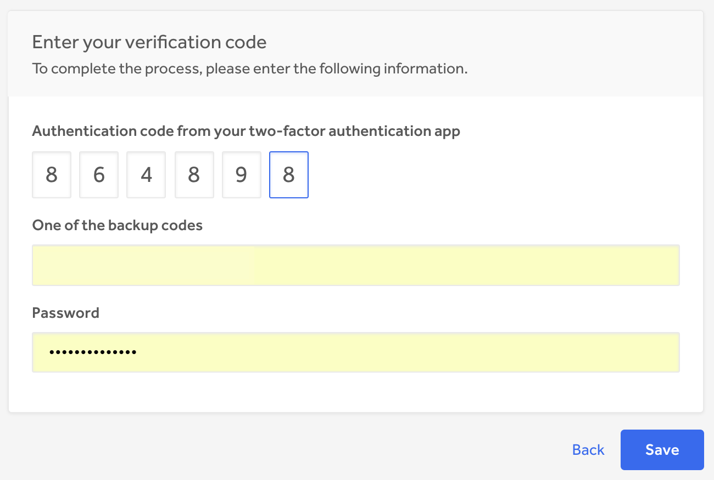
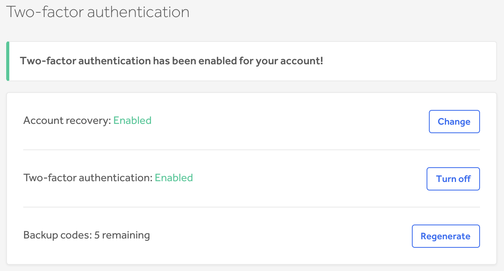
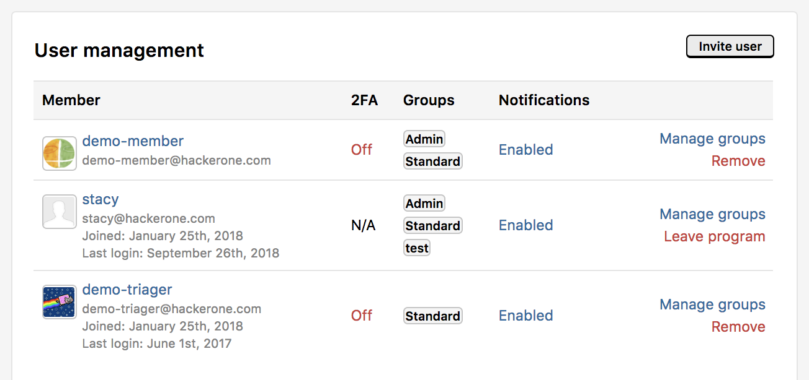

Two-factor authentication (2FA) enables you to add an extra layer of protection from getting your account compromised. You can set up two-factor authentication using any device capable of generating Time-based One-Time Password (TOTP) authentication codes (RFC 6238) to log in to your HackerOne account. You can use Google Authenticator or Duo Mobile or any other compatible application to generate the codes.

Two-factor authentication is encouraged but not required on HackerOne. It’s our belief that each step throughout the vulnerability submission process introduces another opportunity for the finder to abandon their disclosure efforts. As a platform, HackerOne prioritizes making it as easy as possible to disclose a vulnerability so it can be safely resolved. Reducing barriers for submission helps ensure more vulnerabilities end up in the hands of those that can fix them. Individual programs can choose to require two-factor authentication for all submissions.

### Set Up

To set up two-factor authentication for your account:
1. Go your profile’s  **Settings > Authentication**.

2. Click **Set up**.

3. Add your phone number and click **Next**.

4. Enter the verification code sent to your phone number. This will enable account recovery.

5. Click **Turn on** to enable two-factor authentication.

6. Scan the QR  code in your authenticator app or enter the code manually.

7. Store your backup codes.

8. Enter the verification code from your authenticator app as well as one of the backup codes from the previous page.

9. Click **Save**.

Once your two-factor authentication is successfully enabled, you’ll be prompted to enter a 6-digit verification code from your authenticator app to log in to your HackerOne account.

You can choose to change your account recovery phone number, turn off two-factor authentication, or regenerate your backup codes.

Once your two-factor authentication has been verified, when you log in to HackerOne, you’ll be prompted to enter a 6-digit verification code from your authentication application. You must enter the verification code in order to successfully log in to HackerOne.

On your user management settings, under <b>Settings > General > User Management</b>, you'll be able to see those with two-factor authentication on or off via the 2FA column. Users with **N/A** mean that they are authenticating via Single Sign-On (SSO) using a third-party identity provider. For example, HackerOne Security Analysts will have a 2FA status of N/A because they use SSO.

><i>Note: Two-factor Authentication is on a per-user basis. You can’t have SSO and 2FA simultaneously.</i>

If a program adds multi-factor authentication to its requirements, the following will happen automatically:
1. Hackers who do not have it will be removed from the program.
2. Removed hackers will receive an invite explaining they must add multi-factor authentication in order to rejoin the program.

If a hacker removes multi-factor authentication from their preferences:
1. The hacker will be removed from all programs requiring it.
2. The hacker will receive invitations explaining they must add multi-factor authentication in order to rejoin the programs.
